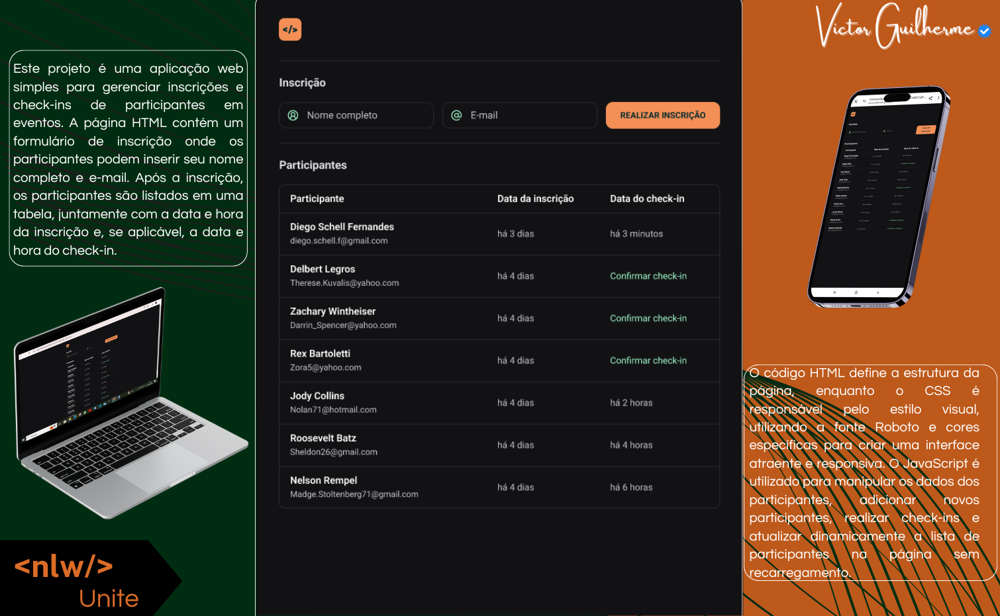

  

Aplicação desenvolvida no NLW Unite da Rocketseat na trilha HTML+CSS+JS.

  <a href="#-projeto">Projeto</a>&nbsp;&nbsp;&nbsp;|&nbsp;&nbsp;&nbsp;
  <a href="#-projeto">Explicação</a>&nbsp;&nbsp;&nbsp;|&nbsp;&nbsp;&nbsp;
  <a href="#-tecnologias">Tecnologias</a>&nbsp;&nbsp;&nbsp;&nbsp;&nbsp;&nbsp;

  

 

  

## 🌐 Projeto

Nesse projeto iremos desenvolver a versão simplificada de um sistema de check-in para eventos presenciais.

 

## 🎯 Explicação 

Este projeto é uma aplicação web simples para gerenciar inscrições e check-ins de participantes em eventos. A página HTML contém um formulário de inscrição onde os participantes podem inserir seu nome completo e e-mail. Após a inscrição, os participantes são listados em uma tabela, juntamente com a data e hora da inscrição e, se aplicável, a data e hora do check-in.

O código HTML define a estrutura da página, enquanto o CSS é responsável pelo estilo visual, utilizando a fonte Roboto e cores específicas para criar uma interface atraente e responsiva. O JavaScript é utilizado para manipular os dados dos participantes, adicionar novos participantes, realizar check-ins e atualizar dinamicamente a lista de participantes na página sem recarregamento.

O código JavaScript contém uma lista predefinida de participantes com seus nomes, e-mails, datas de inscrição e datas de check-in (se aplicável). Além disso, funções são definidas para criar novos participantes, atualizar a lista de participantes na página e realizar check-ins.
Em suma, este projeto fornece uma base para construir uma aplicação de gerenciamento de eventos mais complexa, permitindo que os organizadores registrem e acompanhem as inscrições e check-ins dos participantes de forma eficiente.

 

## 🚀 Tecnologias

Esse projeto foi desenvolvido com as seguintes tecnologias:

- HTML
- CSS
- JavaScript

